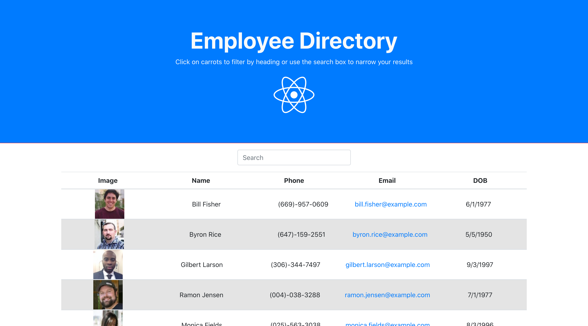
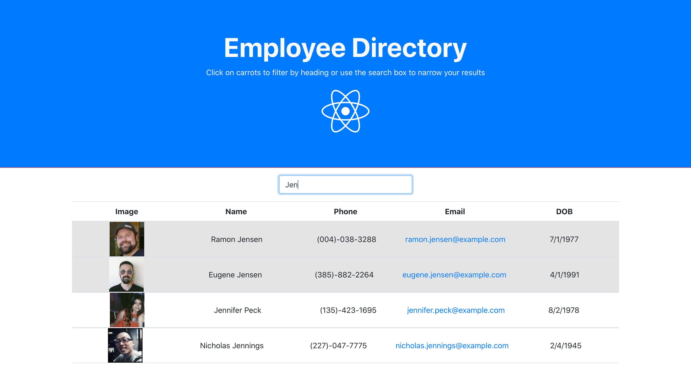
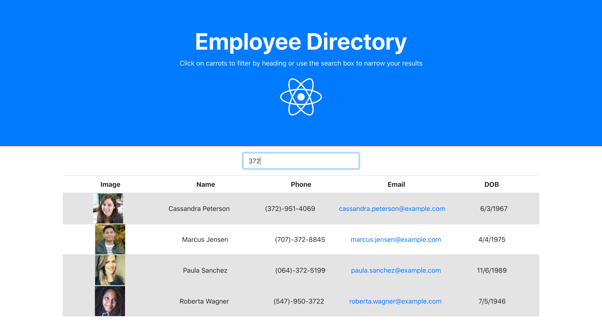

# Employee_Directory

## Author
Edward Reyes

## Tables of Contents

* [Description](#description)

* [Installation](#installation)

* [Challenges](#challenges)

* [Demo](#questions)

## Description

This is an employee directory created using React.js.

### User Story
As a user, I want to be able to view my entire employee directory at once so that I have quick access to their information.

### Business Context
An employee or manager would benefit greatly from being able to view non-sensitive data about other employees. It would be particularly helpful to be able to filter employees by name.

## Installation

To install the necessary dependencies, run the following command:

```
npm i
```

## Challenges

Working with state changes and setting onChange functions to external input components.

## Demo 
[netlify-deployment](https://determined-kowalevski-974a9d.netlify.app/)

### Main display

### Search by name

### Search by phone

### Search by DOB

